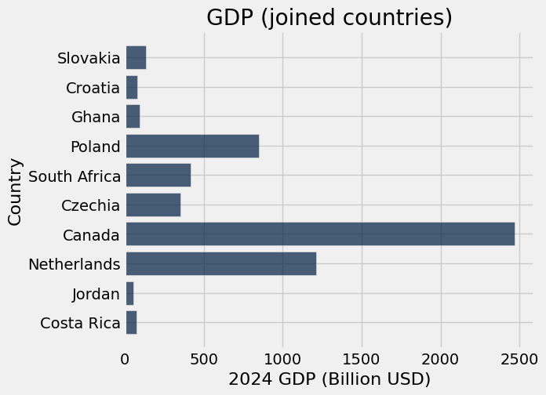
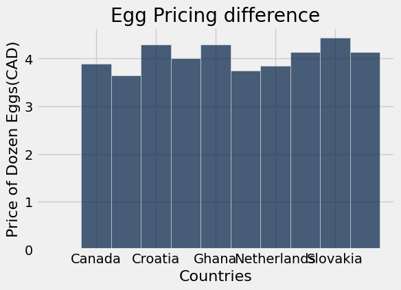
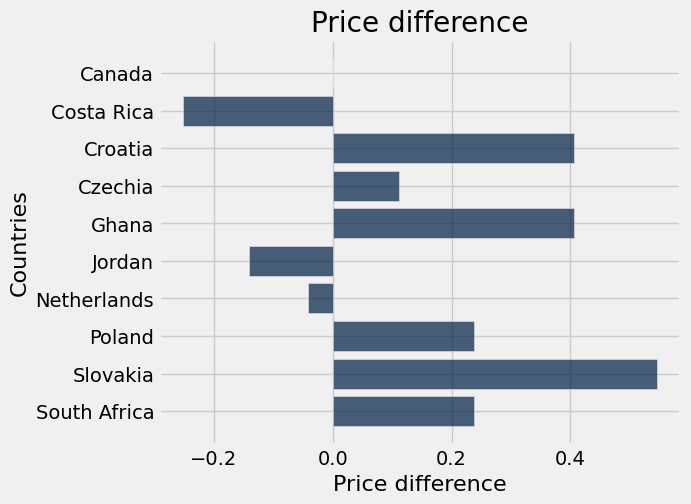
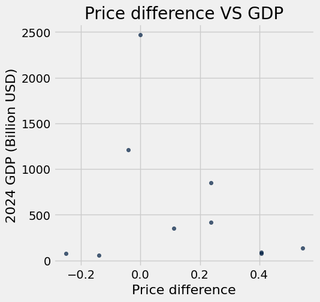

# Assignment3 Presentation
Miao Bosen, Riley Andreachuk

# Introduction
When it comes to agricultural products, eggs must be one of those things that come to your mind. It is undoubtedly one of the most popular food worldwide due to its high nutritional value, delicious taste and affordable price. In this project, we will work on the price of eggs and discover its correlation with countries’ GDP.

