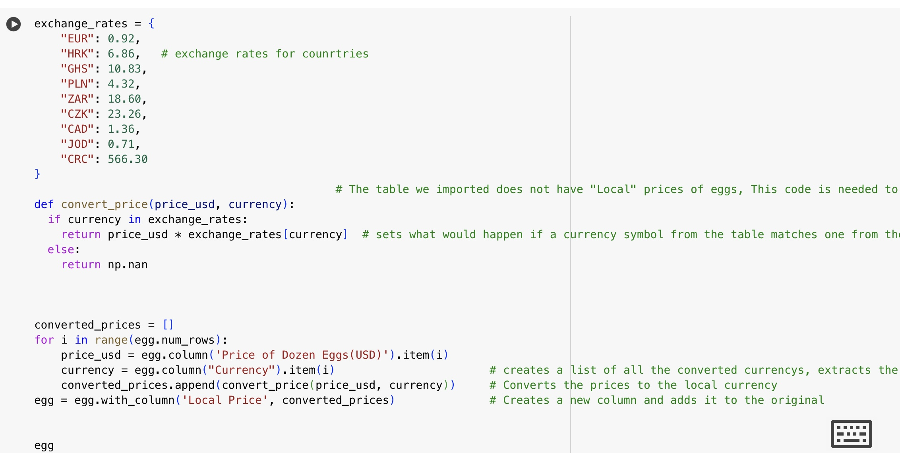

# Presentation
Miao Bosen, Riley Andreachuk

# Introduction
When it comes to agricultural products, eggs must be one of those things that come to your mind. It is undoubtedly one of the most popular food worldwide due to its high nutritional value, delicious taste and affordable price. In this project, we will work on the price of eggs and discover its correlation with countries’ GDP.

# Analysis
Here is our work on the [Google Colab](Presentation.ipynb)

# The reason why we choose GDP as the external factor
A high GDP often means higher productivity and demand, which can affect egg prices. GDP is also related to several concepts like inflation and international trade. We believe that GDP is not a direct factor in determining egg prices, but it can indirectly affect it through various mechanisms such as supply and demand, production costs, and policies.

# Conclusion
The main difficulty in this project is converting the price to each countries' local price.
According to the research, among the ten countries we selected, Costa Rica has the lowest price and Ghana has the highest price.
-0.2 indicates that there is a very weak negative linear relationship between countries' GDP and egg prices,which means GDP may not have an impact on the price.
